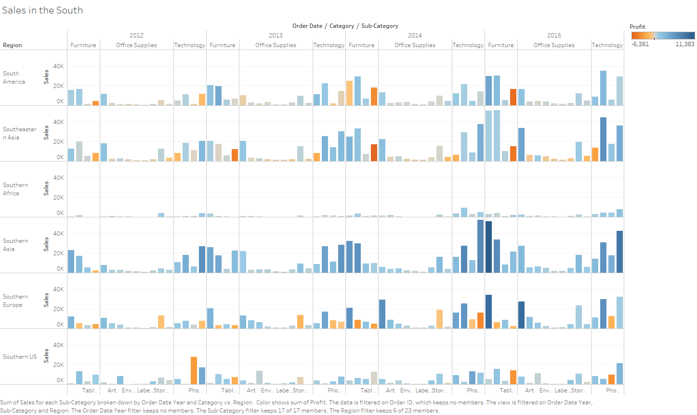
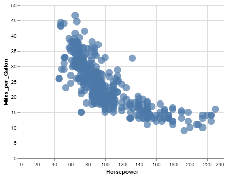

```{r setup, include=FALSE}
knitr::opts_chunk$set(echo = TRUE)
```

CS 625, Fall 2020

## Git, GitHub

1. *What is your GitHub username?*
=> javedulferdous

2. *What is the URL of your remote GitHub repo (created through Mr. Kennedy's exercises)?*
=> https://github.com/javedulferdous/cs625-data-visualization.git

## R

The command below will load the tidyverse package.  If you have installed R, RStudio, and the tidyverse package, it should display a list of loaded packages and their versions.
```{r}
library(tidyverse)
```

## R Markdown 

1. *Create an ordered bulleted list with at least 3 items*
=> 
   1. Item 1
   2. Item 2
   3. Item 3

2. *Write a paragraph that demonstrates the use of italics, bold, bold italics, and code.*
=> This is a demonstration of *italics*, **bold**, **_bold italic_** , ```console.log("Hello") ```

3. *Create an example of a fenced code block.*

```
function hello() {
  console.log("Hello World!");
}
```

4. *Create a level 4 heading*

#### Header 4

## R 

#### Data Visualization Exercises

1. *Run ggplot(data = mpg). What do you see?*
=> It creates an empty plot

2. *How many rows are in mpg? How many columns?*
=> row 234, column 11

3. *What does the drv variable describe? Read the help for ?mpg to find out.*

4. *Make a scatterplot of hwy vs cyl.*


5. *What happens if you make a scatterplot of class vs drv? Why is the plot not useful?*


#### Workflow: basics Exercises

1. *Why does this code not work?*

```r
my_variable <- 10
my_varıable
```
=> There is '1' instead of having i in my_variable.

2. *Tweak each of the following R commands so that they run correctly:*

```r
library(tidyverse)
ggplot(data = mpg) + 
  geom_point(mapping = aes(x = displ, y = hwy))
fliter(mpg, cyl = 8)
filter(diamond, carat > 3)
```
=> 
```r
library(tidyverse)
ggplot(data = mpg) +
  geom_point(mapping = aes(x = displ, y = hwy))
filter(mpg, cyl == 8)
filter(diamonds, carat > 3)
```

3. *Press Alt + Shift + K. What happens? How can you get to the same place using the menus?*
=> The keyboard shortcuts help display appears.

## Tableau

*Insert your the image of your final bar chart here*

1. *What conclusions can you draw from the chart?*
=> 

The image of the final bar chart depict some potential prospects in the Southern part of the word. For example, Southern Asia is highly potential for furniture in 2015 whereas in 2012 it was a completely different scenario. As for the Southern part of Africa, it was never a good time for sale any year from 2012-2015. Southern US has almost second-worst progress after Southern Africa.

## Observable and Vega-Lite

### A Taste of Observable

1. *In the "New York City weather forecast" section, try replacing `Forecast: detailedForecast` with `Forecast: shortForecast`. Then press the blue play button  or use Shift-Return to run your change. What happens?*
=> Forcast description became more shorter. ususally it was like two words to describe each day weather condition.

1. *Under the scatterplot of temperature vs. name, try replacing `markCircle()` with `markSquare()`. Then press the blue play button  or use Shift-Return to run your change. What happens? How about `markPoint()`?*
=> The marks on the graph take a square shape when we replace markCircle() with markSquare(). Using markPoint() the all square point became small ring circle.

1. *Under "Pick a location, see the weather forecast", pick a location on the map.  Where was the point you picked near?*
=> Pick Location : Longitude: -77.11     Latitude: 37.41.
   Picked a point near Norfolk, VA.


1. *The last visualization on this page is a "fancy" weather chart embedded from another notebook.  Click on the 3 dots next to that chart and choose 'Download PNG'.  Insert the PNG into your report.*


### Charting with Vega-Lite

1. *Pass an option of { size: 200 } to markCircle().*
=> The size of the *circle* marks have increased to 200 unit.


1. *Try markSquare instead of markCircle.*
=> The shaped of marks changed from *circular* to *square*.


1. *Try markPoint({ shape: 'diamond' }).*
=> The size of the marks is back to default and shape in changed to diamond.


1. *Change Horsepower to Acceleration*
=> The *x-axis label* is changed from *Horsepower* to *Acceleration*


1. *Swap what fields are displayed on the x- and y-axis* 
=>Now *x-axis* became *Miles_per_Gallon* and *y-axi*s became *Acceleration*


1. *Change Name to Origin.*
=> Changed name to origin but no changes is be seen


1. *Remove the vl.y().fieldN("Origin") line.*
=> Only one field of total records is seen in the chart. No country record is available in this chart. 


1. *Replace count() with average("Miles_per_Gallon").*
=>The average is shown in place of the count of records.


## References

*Insert the list of sites you used as references as an unordered list with named links here.  This is required.*

1. [R for Data Science](https://r4ds.had.co.nz/)
<<<<<<< HEAD
2. [Lesson 6. Add Images to an R Markdown Report](https://www.earthdatascience.org/courses/earth-analytics/document-your-science/add-images-to-rmarkdown-report/)
=======
2. [Lesson 6. Add Images to an R Markdown Report](https://www.earthdatascience.org/courses/earth-analytics/document-your-science/add-images-to-rmarkdown-report/)
>>>>>>> 21f02bffb087db825442d0c30684849b942ea6a6
